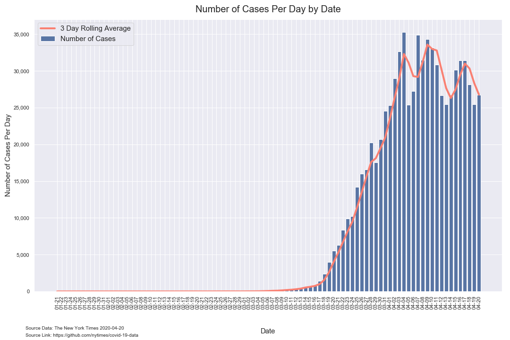

# Analysis of COVID-19 County Data from The New York Times

*Author: Mark Bauer*  
*Date Updated: April 12, 2020*  
*Date Updated: April 27, 2020*

The New York Times Github Data Repository: https://github.com/nytimes/covid-19-data.   
The New York Times News Article: https://www.nytimes.com/article/coronavirus-county-data-us.html.  
The New York Times COVID-19 US Map: https://www.nytimes.com/interactive/2020/us/coronavirus-us-cases.html.   
The New York Times COVID-19 Global Map: https://www.nytimes.com/interactive/2020/world/coronavirus-maps.html.  

# Tables

**Table 1. Coronavirus (COVID-19) Cases in the United States by County (Top 10 Counties)**

|    | date       | county        | state      | cases   | deaths   |
|---:|:-----------|:--------------|:-----------|--------:|---------:|
|  0 | 2020-04-26 | New York City | New York   | 158,268 | 11,648   |
|  1 | 2020-04-26 | Nassau        | New York   | 34,522  | 1,962    |
|  2 | 2020-04-26 | Suffolk       | New York   | 32,059  | 1,115    |
|  3 | 2020-04-26 | Cook          | Illinois   | 30,574  | 1,313    |
|  4 | 2020-04-26 | Westchester   | New York   | 27,664  | 1,054    |
|  5 | 2020-04-26 | Los Angeles   | California | 19,528  | 913      |
|  6 | 2020-04-26 | Wayne         | Michigan   | 15,748  | 1,580    |
|  7 | 2020-04-26 | Bergen        | New Jersey | 14,965  | 955      |
|  8 | 2020-04-26 | Hudson        | New Jersey | 13,708  | 661      |
|  9 | 2020-04-26 | Essex         | New Jersey | 12,863  | 1,023    | 

# Bar Charts

  

  

# Figures

##  Number of Positives Per Day

### Weekly Average

 

### Daily

##  Growth Factor of Number of Positives per Day

### Weekly Average

### Daily 

## Cumulative Number of Positive Cases  

### Top 10 Counties

  

### All Counties

## Trajectory of Number of Positive Cases

   

 

## Time Series

### Top 10 Counties

  

