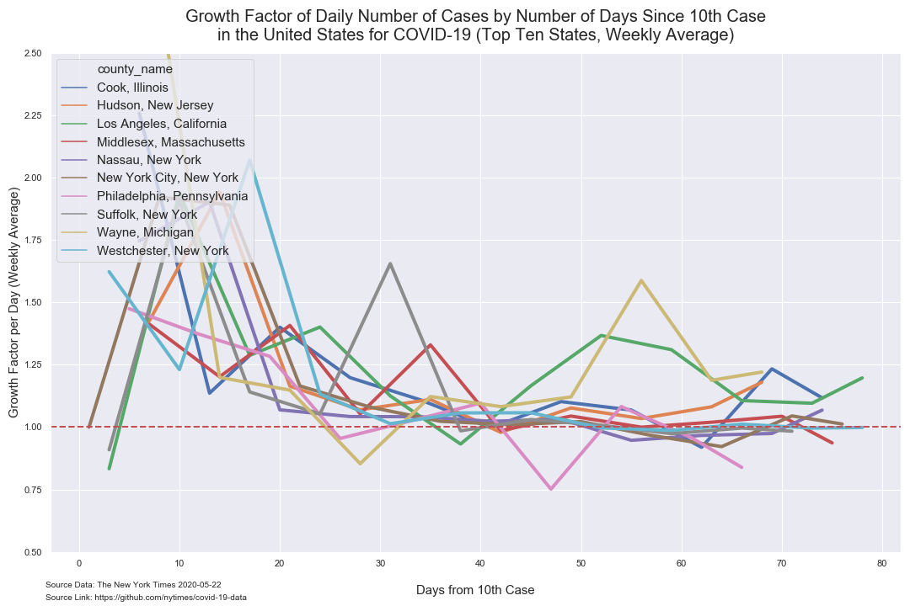
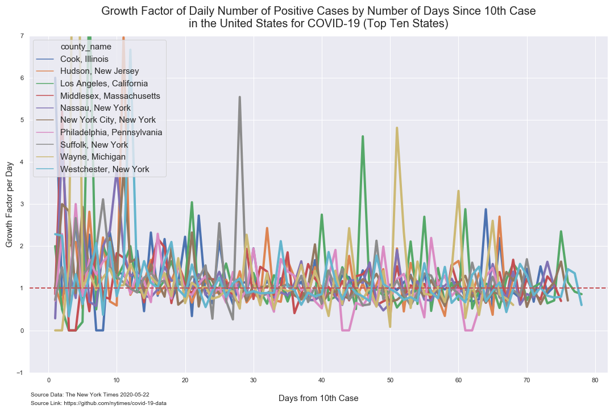
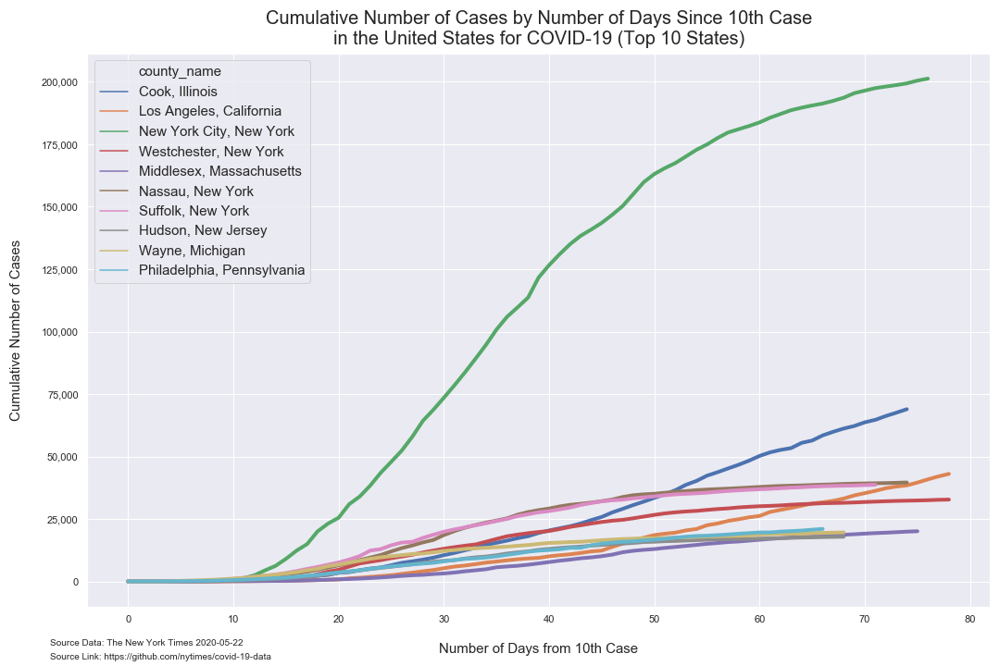
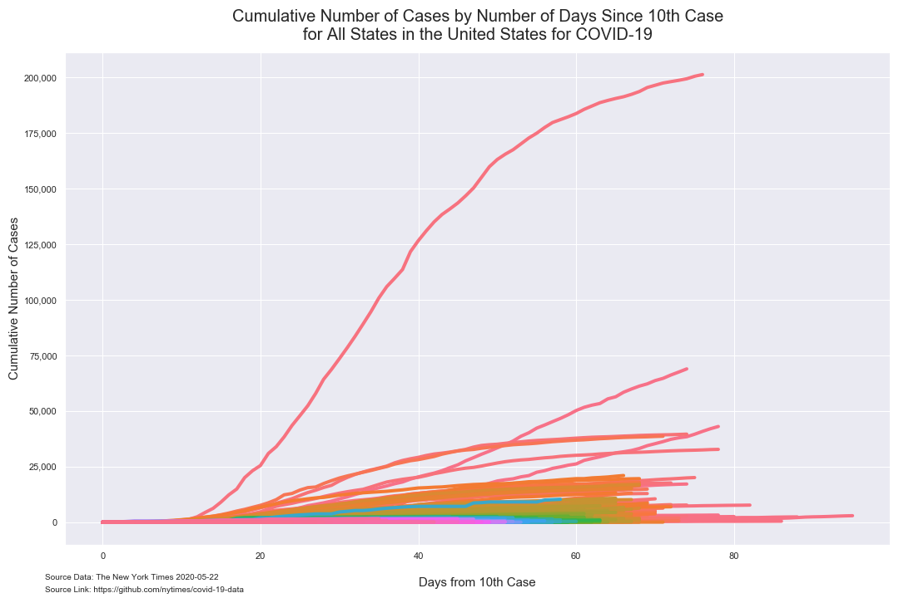
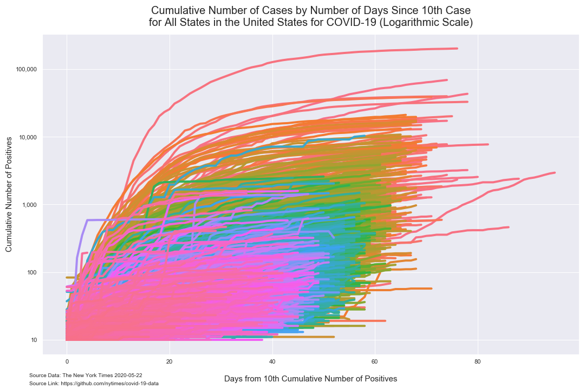
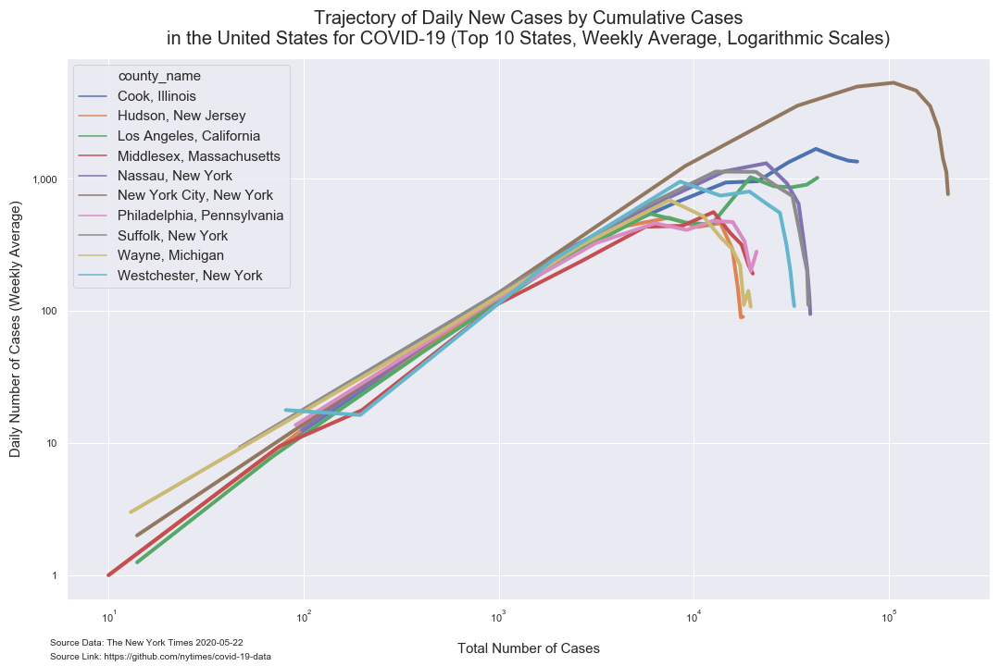

# Analysis of COVID-19 County Data from The New York Times

*Author: Mark Bauer*  
*Date Updated: April 12, 2020*  
*Date Updated: May 24, 2020*

The New York Times Github Data Repository: https://github.com/nytimes/covid-19-data.   
The New York Times News Article: https://www.nytimes.com/article/coronavirus-county-data-us.html.  
The New York Times COVID-19 US Map: https://www.nytimes.com/interactive/2020/us/coronavirus-us-cases.html.   
The New York Times COVID-19 Global Map: https://www.nytimes.com/interactive/2020/world/coronavirus-maps.html.  

# Tables

**Table 1. Coronavirus (COVID-19) Cases in the United States by County (Top 10 Counties)**

|    | date       | county        | state      | cases   | deaths   |
|---:|:-----------|:--------------|:-----------|--------:|---------:|
|  0 | 2020-05-22 | New York City | New York      | 201,298 | 20,569   |
|  1 | 2020-05-22 | Cook          | Illinois      | 68,949  | 3,187    |
|  2 | 2020-05-22 | Los Angeles   | California    | 43,052  | 2,049    |
|  3 | 2020-05-22 | Nassau        | New York      | 39,608  | 2,572    |
|  4 | 2020-05-22 | Suffolk       | New York      | 38,672  | 1,863    |
|  5 | 2020-05-22 | Westchester   | New York      | 32,766  | 1,444    |
|  6 | 2020-05-22 | Philadelphia  | Pennsylvania  | 21,009  | 1,221    |
|  7 | 2020-05-22 | Middlesex     | Massachusetts | 20,085  | 1,496    |
|  8 | 2020-05-22 | Wayne         | Michigan      | 19,602  | 2,323    |
|  9 | 2020-05-22 | Hudson        | New Jersey    | 17,897  | 1,134    | 

# Bar Charts

  

  

# Figures

##  Number of Positives Per Day

### Weekly Average

 

### Daily

##  Growth Factor of Number of Positives per Day

### Weekly Average

### Daily 

## Cumulative Number of Positive Cases  

### Top 10 Counties

  

### All Counties

## Trajectory of Number of Positive Cases

   

 

## Time Series

### Top 10 Counties

  

