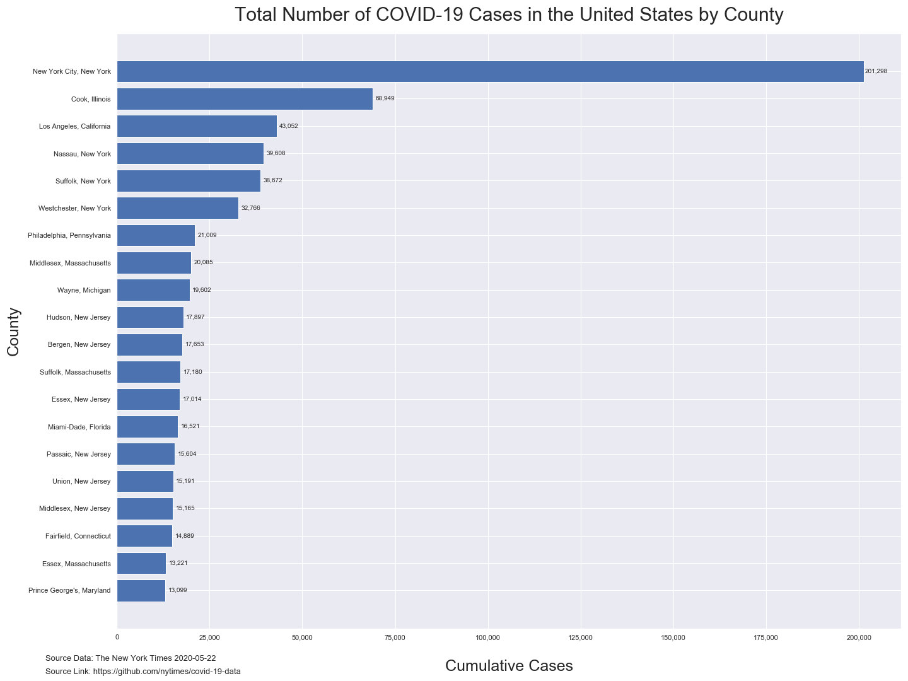
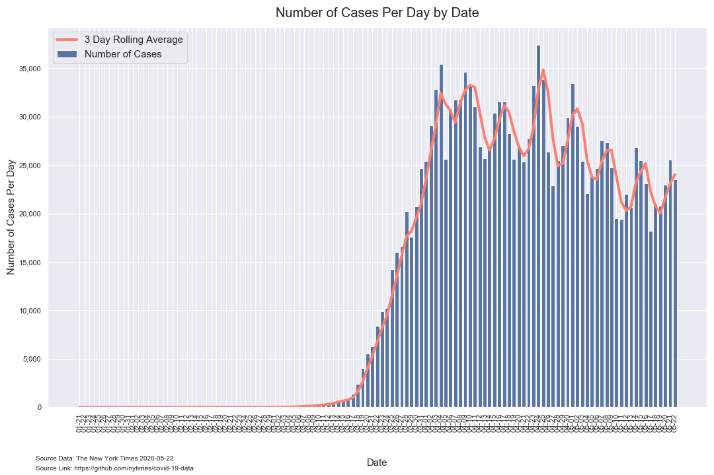
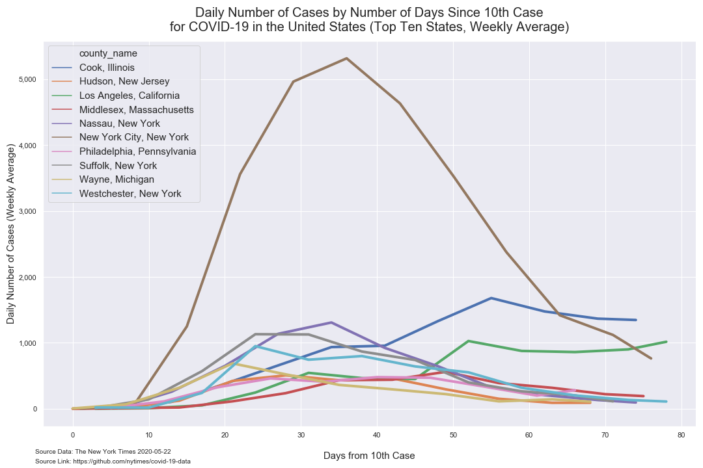
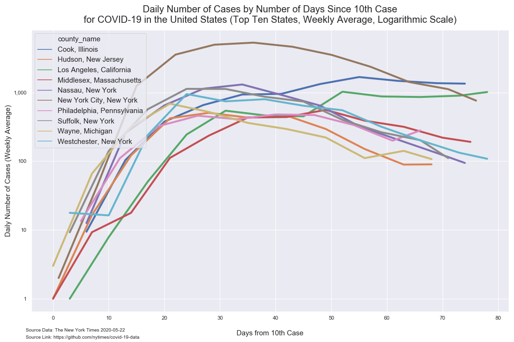
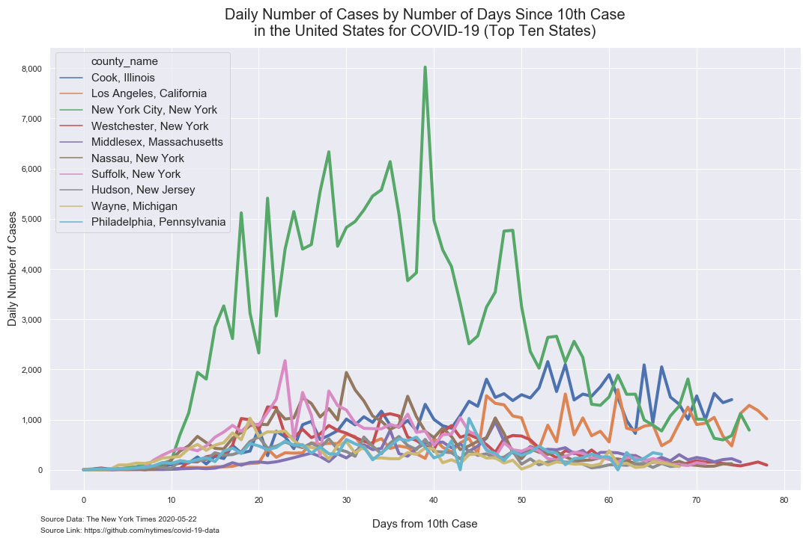
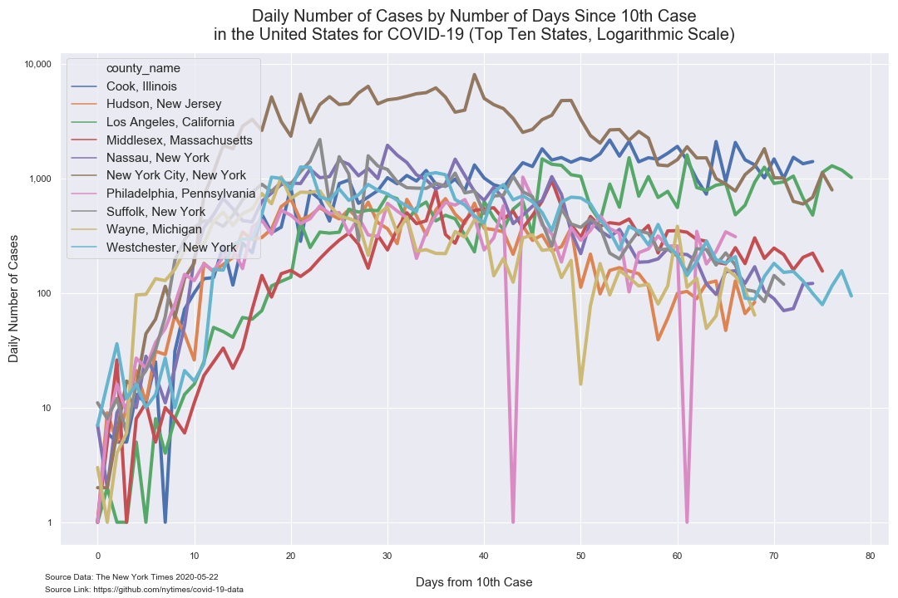
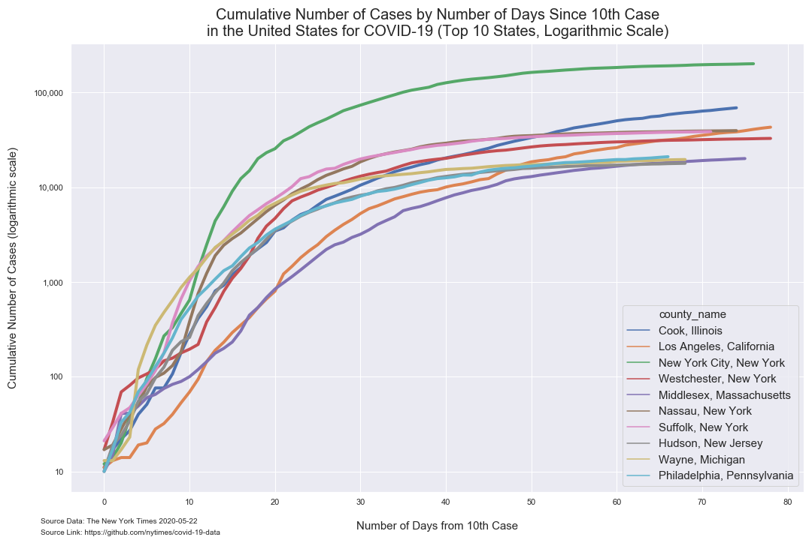
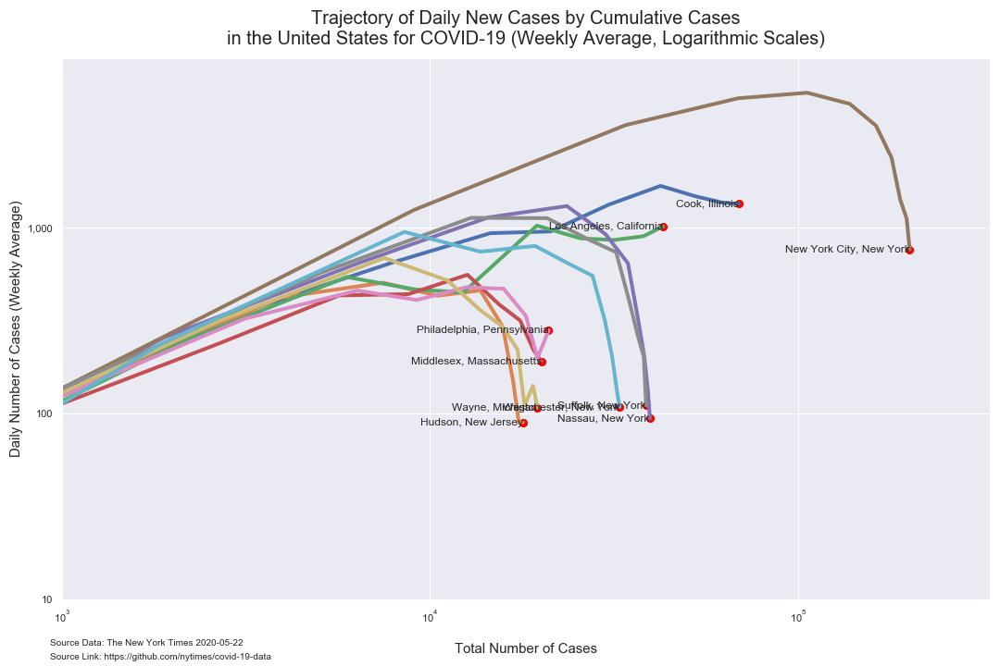
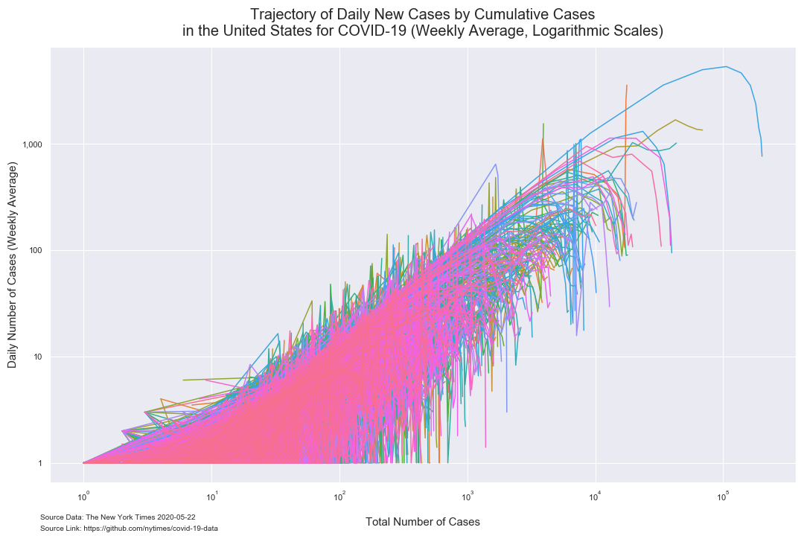
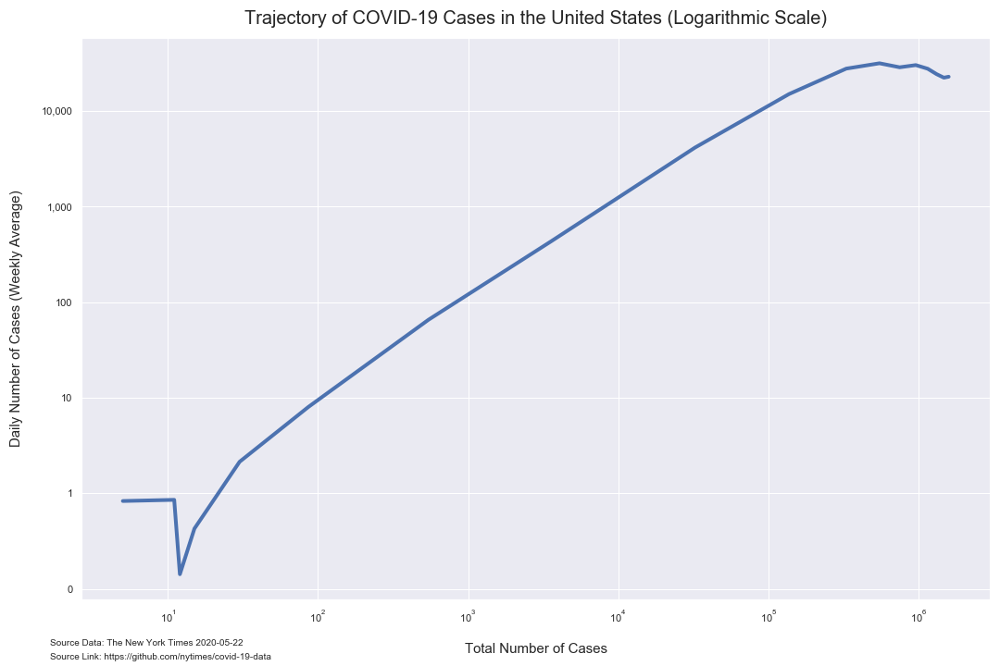

# Analysis of COVID-19 County Data from The New York Times

*Author: Mark Bauer*  
*Date Updated: April 12, 2020*  
*Date Updated: May 6, 2020*

The New York Times Github Data Repository: https://github.com/nytimes/covid-19-data.   
The New York Times News Article: https://www.nytimes.com/article/coronavirus-county-data-us.html.  
The New York Times COVID-19 US Map: https://www.nytimes.com/interactive/2020/us/coronavirus-us-cases.html.   
The New York Times COVID-19 Global Map: https://www.nytimes.com/interactive/2020/world/coronavirus-maps.html.  

# Tables

**Table 1. Coronavirus (COVID-19) Cases in the United States by County (Top 10 Counties)**

|    | date       | county        | state      | cases   | deaths   |
|---:|:-----------|:--------------|:-----------|--------:|---------:|
|  0 | 2020-05-05 | New York City | New York     | 176,935 | 13,336   |
|  1 | 2020-05-05 | Cook          | Illinois     | 45,223  | 1,922    |
|  2 | 2020-05-05 | Nassau        | New York     | 37,152  | 2,250    |
|  3 | 2020-05-05 | Suffolk       | New York     | 35,275  | 1,347    |
|  4 | 2020-05-05 | Westchester   | New York     | 30,239  | 1,236    |
|  5 | 2020-05-05 | Los Angeles   | California   | 27,815  | 1,313    |
|  6 | 2020-05-05 | Wayne         | Michigan     | 17,391  | 1,945    |
|  7 | 2020-05-05 | Bergen        | New Jersey   | 16,460  | 1,261    |
|  8 | 2020-05-05 | Philadelphia  | Pennsylvania | 16,410  | 743      |
|  9 | 2020-05-05 | Hudson        | New Jersey   | 16,099  | 870      | 

# Bar Charts

  

  

# Figures

##  Number of Positives Per Day

### Weekly Average

 

### Daily

##  Growth Factor of Number of Positives per Day

### Weekly Average

### Daily 

## Cumulative Number of Positive Cases  

### Top 10 Counties

  

### All Counties

## Trajectory of Number of Positive Cases

   

 

## Time Series

### Top 10 Counties

  

